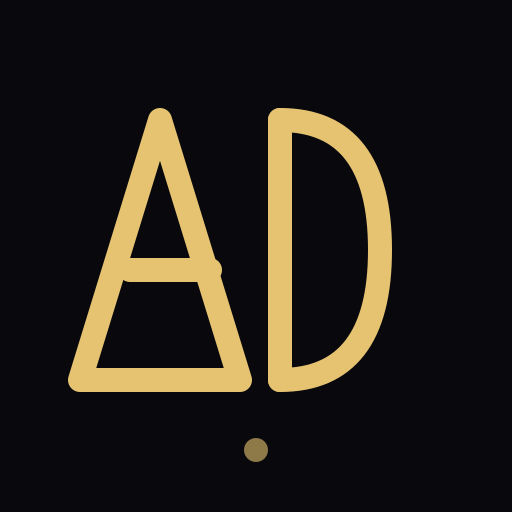

# AD Logo Design Guide

## Overview

The **AD** logo is a modern, geometric symbol representing Amritam Das through clean, interconnected letterforms with a contemporary design aesthetic.

### Design Philosophy

- **A** — Triangle-based geometric form, representing stability and upward direction
- **D** — Rounded semicircle with vertical backbone, representing growth and connection
- **Bronze/Gold Color** — Warmth and sophistication representing professionalism and approachability
- **Minimalist Approach** — Clean lines and geometric shapes for modern, professional appearance
- **Accent Detail** — Subtle dot element for visual balance and presence

## Files Included

### 1. **ad-logo.svg** (Full-size geometric AD)
- Scalable vector version
- Best for: large displays, printing, vector editing
- Viewbox: 512×512

### 2. **favicon.svg** (Small geometric AD)
- Optimized for browser tabs
- Same design as ad-logo.svg
- Viewbox: 64×64

### 3. **favicon-32.png** (32×32 AD logo)
- Standard favicon size
- Generated from SVG source

### 4. **favicon-192.png** (192×192 AD logo)  
- High-resolution favicon
- For modern devices and PWA icons

### 5. **apple-touch-icon.png** (180×180 AD logo)
- iOS home screen icon
- Optimized for Apple devices

## Usage Guidelines

### Color
- **Primary:** Bronze/Gold (`#E6C371`)
- **Background:** Dark (`#09090D` recommended)
- **Accent:** Warm metallic highlight for premium contrast

### Sizes & Applications

| Use Case | Size | Format | File |
|----------|------|--------|------|
| Browser favicon | 32×32px | PNG | favicon-32.png |
| Browser favicon | 64×64px | SVG | favicon.svg |
| High-res icon | 192×192px | PNG | favicon-192.png |
| Apple touch icon | 180×180px | PNG | apple-touch-icon.png |
| Source vector | 512×512px | SVG | ad-logo.svg |

### Integration Tips

1. **Web Embedding**
   ```html
   
   ```

2. **CSS Background**
   ```css
   .header {
     background-image: url('ad-logo.svg');
     background-size: contain;
     background-repeat: no-repeat;
   }
   ```

3. **Export to Other Formats**
   - SVG → PNG: Use browser "Save as" or any vector editor
   - SVG → PDF: Use browser print-to-PDF or Inkscape
   - SVG → ICO: Use Pillow or any favicon generator

## Design Elements Explained

### Letterforms
- **A** — Strong triangular form, pointing upward for growth
- **D** — Rounded shape with a vertical backbone for stability and continuity
- **Accent dot** — Adds balance and a subtle signature detail

### Style
- Minimal geometric construction
- Bronze/gold stroke on deep dark background
- Clean lines optimized for small and large sizes

## Recommended Contexts

✅ **Best For:**
- Website icons and favicons
- App and mobile icons
- Personal branding and profile images
- Presentation headers and document identity

❌ **Avoid:**
- Very low-contrast, busy backgrounds
- Tiny usage below 16px without fallback

## Typography Pairing

The logo pairs well with:
- **Space Grotesk** for display headings
- **Inter** for body text
- **DM Mono** for technical notes

## Technical Specifications

- **Format:** SVG
- **Source:** `ad-logo.svg`
- **Favicon files:** `favicon.svg`, `favicon-32.png`, `favicon-192.png`, `apple-touch-icon.png`, `favicon.ico`
- **Color space:** sRGB
- **Accessibility:** High contrast for dark UI

---

**Brand:** Amritam Das — geometric AD identity
**Style:** Modern, minimal, professional visual mark
